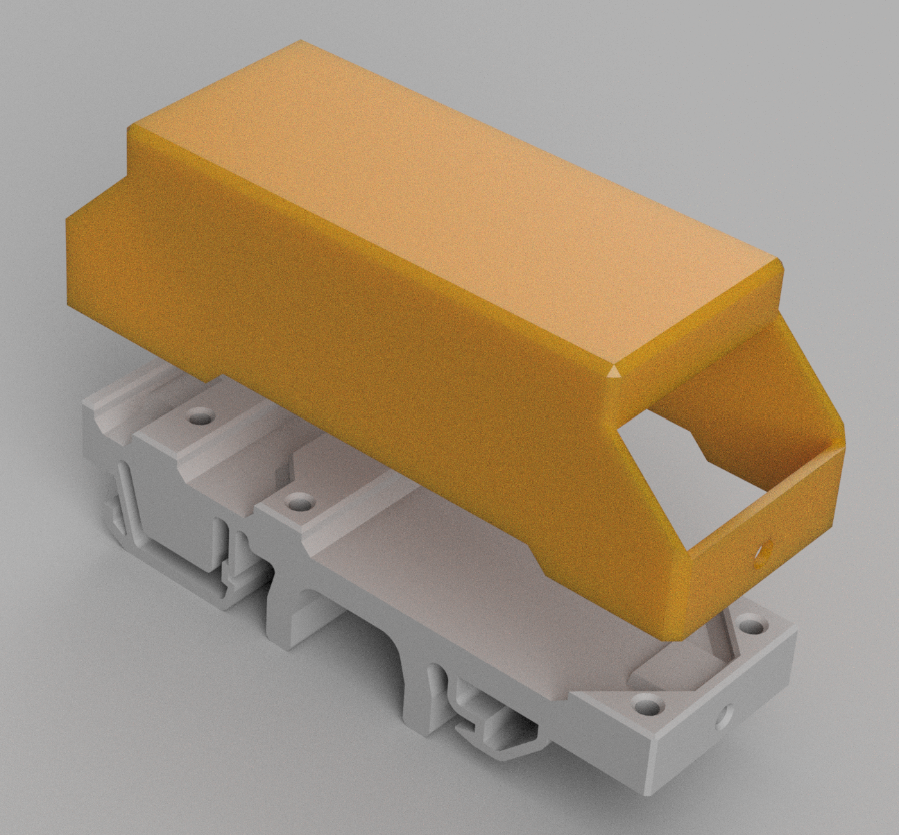

### DIV WallBox Wi-Fi ModBus ESP32 proxy

I have finished building my home DIY WallBox based on a great solution from creasol.it called [DombusEVSE](https://www.creasol.it/DomBusEVSE). Creasol has a lot of interesting smart home devices on offer and the solution they have chosen is very much based on the popular ModBus protocol. Unfortunately, in my WallBox it would be difficult for me to apply this solution because I have quite a long distance and I can't lay a cable for a ModBus connection. But fortunately my WallBox location is in range of my home WiFi network. Having already in my Home Assistant other integrations based on ESPHome, I decided to make a proxy adapter for ModBus. I used the XIAO Seed ESP32C3 board and a TTL RS485 adapter as the platform. I "stole" power from the DombusEVSE power supply (13.6V) and used a popular Pololu step-down converter. As I already had a previously purchased 3-phase energy meter with a "pulse" output, I also used the XIAO to measure and record the energy used to charge the EV.

It all seemed simple and straightforward, but as always life is much more interesting than we imagine.

Creasol.it provides ready-made configurations for HA, so in my first attempt I made a yaml ESPHome based on their ModBus controller https://github.com/CreasolTech/DomBusEVSE_ha.

This worked, but only partially. It seems to me that the ModBus component in ESPHome has a problem reading multiple registers with high addresses. I have described the problem on ESPHome's GitHub: https://github.com/esphome/issues/issues/6351. Registers with low addresses are read and written without problems. Writing to high addresses is correct, the problem is with sequential reading. Interestingly, reading with the custom method works fine. This allowed me to create a workaround for the problem. For high registers I defined a double set of entities. Read-only sensors, which are queried by the custom method, and a complementary numeric set, which is used for writing only.

Of course, this required adapting the original HA configuration files from the creasol.it.

My hardware WallBox is built in a variant that allows switching between single-phase and three-phase charging. I also wanted a mobile version of the dashboard. I took the opportunity to practice building my own dashboard in HA using the famous custom:button-card, custom:layout-card, custom:text-divider-row - all downloadable from HACS.

Desktop version of Home Assistant Dashboard:

and it's mobile version:

I built the Wi-Fi ModBus proxy module from this schematic, soldered it to a piece of universal PCB and put it in a small 3D printed PETG case. In my case, I replaced the original XIAO Wi-Fi antenna with a slightly more efficient one (from the NanoPi Duo2 module) for more reliable communication. If you want to use my files in your project, you can do so without any restrictions. 

I will follow the changes on ESPHome and if some good soul finds/corrects the source of the problem with reading high registers I, for my part, will apply modifications to remove the workarounds. Unfortunately I'm probably too lame to detect the source of the problem in the ESPHome code myself 😬.